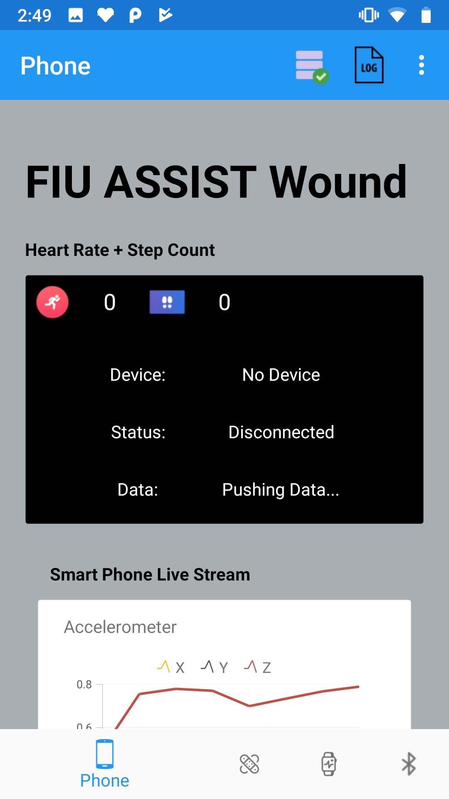
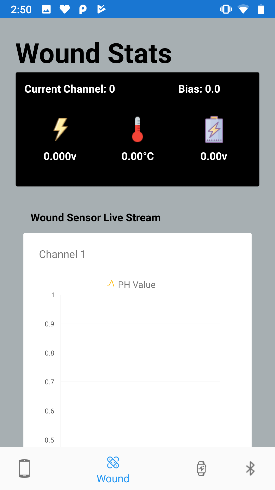
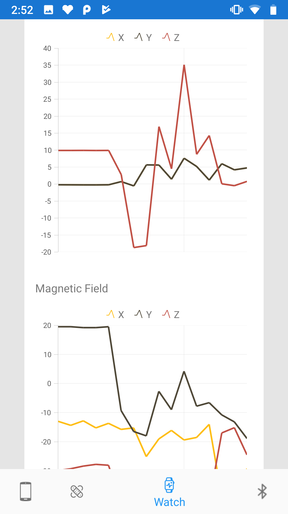

# IoT_Sensor_Collection_Xamarin
This application is a cross-platform sensor collection application that connects to specific bluetooth low energy devices and pushes the sensor data to the cloud

# Technologies
- C#/Xamarin
- XAML
- Microsoft Azure Database

#  Application Images

## Main Page

## Wound Sensor Page

## Data Visualization

## Smart Watch Connected

